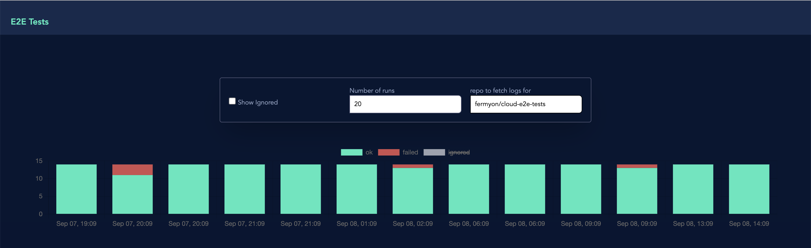
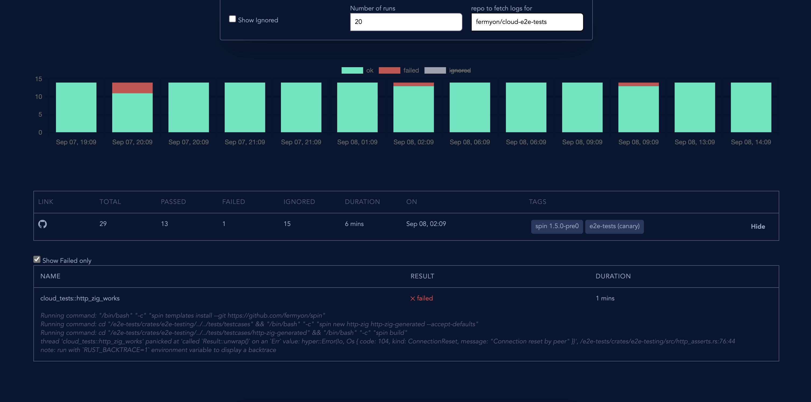

# Tests Dashboard

This app provides a Tests Dashboard that helps track the test results overtime.

## Summary Trends


## Details of single run

populated on clicking the graph bar



This is developed using `golang/tinygo/nuxtjs/Spin` and deployed on Fermyon Cloud. It makes use of Fermyon's NoOps SQLite integration to store the results.

## Getting started

Prerequisites:

- Ensure [Spin is installed](https://developer.fermyon.com/spin/install)
- Refer to [guide here](https://developer.fermyon.com/spin/go-components) for getting started with `Spin` and `Go` (I used `go 1.20` and `tinygo 0.28.0` for developing this app)
- Install npm/yarn


```bash
## clone the repo
git clone git@github.com:rajatjindal/tests-dashboard.git
cd tests-dashboard

## run npm install
cd ui
npm install

## go back to parent dir
cd ..

## build the app
spin build
```

### Running locally

```bash

spin up

## bootstrapping the schema when running locally
## connect to sqlite db in a new terminal
## and run the create table statements from backend/sql/create-table.sql
sqlite3 .spin/sqlite_db.db

### Inject some sample test results
curl -vXPOST http://localhost:3000/api/run/unique-run-id \
	-H "Content-Type: multipart/mixed" \
	-F "results=@backend/pkg/parser/junit/data/junit.log" \
	-F "metadata={\"runId\":\"unique-run-id\",\"repo\":\"rajatjindal/tests-dashboard\",\"branch\":\"main\",\"format\":\"junit\", \"link\":\"http://link/to/github/actions/or/elsewhere\", \"tags\":\"tag1,tag2\"};type=application/json"

### open browser and navigate to http://localhost:3000/?service=rajatjindal/tests-dashboard
```

### Deploy to Fermyon Cloud

if you prefer to run on Fermyon Cloud (like me), follow following:

- Login to [Fermyon Cloud](https://cloud.fermyon.com)
- Access to [private beta](https://developer.fermyon.com/cloud/noops-sql-db#grant-sqlite-permission) for NoOps SQL. (only required if you wish to deploy to Fermyon Cloud)
- Create a [Personal Access token](https://developer.fermyon.com/cloud/user-settings#create-a-pat) and add it as a GitHub actions secret (with key `FERMYON_CLOUD_TOKEN`)

```bash
##-------------------------------
## deploy on Fermyon Cloud
##-------------------------------
spin deploy

## bootstrapping the schema on Fermyon Cloud
## open a new terminal and run following

## find the cloud database name
spin cloud sqlite list

## Init the schema
spin cloud sqlite execute <db-name> "$(cat backend/sql/create-table.sql)"

### Inject some sample test results
curl -vXPOST https://tests-dashboard-xxxxxxx.fermyon.app/api/run/unique-run-id \
	-H "Content-Type: multipart/mixed" \
	-F "results=@backend/pkg/parser/junit/data/junit.log" \
	-F "metadata={\"runId\":\"unique-run-id\",\"repo\":\"rajatjindal/tests-dashboard\",\"branch\":\"main\",\"format\":\"junit\", \"link\":\"http://link/to/github/actions/or/elsewhere\", \"tags\":\"tag1,tag2\"};type=application/json"

### open browser and navigate to https://tests-dashboard-xxxxxxx.fermyon.app?service=rajatjindal/tests-dashboard
```


#### TODO

- [ ] Add authn/authz
- [ ] Allow pushing results for multiple services/tenants safe